# (C# 코딩 4주차) 간단 계산기 (SimpleCalculator)
 ***-- 22017004 컴퓨터 SW 강희준 --***

## **개요- C# 프로그래밍 학습-** 

**한줄 소개 : 간단한 사칙연산을 수행하는 계산기 프로그램**

### 사용한 플랫폼 :
   - C#, .NET Windows Forms, Visual Studio, GitHub

### 사용한 컨트롤 : 
   - Label, TextBox, Button

### 사용한 기술:
    - C# 프로그래밍, Windows Forms 애플리케이션 개발, 이벤트 핸들링, 예외 처리
    
- 프로그래밍 개념:
    
    - void 메서드, 클래스 구조, 토큰을 이용한 계산 로직 구현
    - TextBox 컨트롤을 이용한 결과값 도출, 예외 처리 (0으로 나누기, 잘못된 입력 등)
    - int.Parse() 메서드를 이용한 문자열을 정수로 변환
    - 변수명.ToString() 메서드를 이용한 정수를 문자열로 변환
    - if-else 문을 이용한 조건문 처리

### 핵심 기능:
   
   - 이벤트 핸들링, 예외 처리, 기본적인 계산기 GUI 디자인
   - 텍스트박스를 통한 결과값 도출(이벤트 연결)
   - 토큰을 이용한 계산 로직 구현
   - 예외 처리 (0으로 나누기, 잘못된 입력 등)
 
   
    § 컨트롤 배치와 기본적인 속성 설정
    § 입력 내용을 입력창과 결과창으로 표시하는 기능 구현
    § 계산기의 사칙연산 기능 구현
    § 계산기에 있는 수정/삭제 기능 구현

# **과제 과정 및 결과**

# (과제1) - 기본 UI 배치 및 기능 구현

## -과제 내용-  

    1. UI 구성
    ▶ TextBox(입력표시, 결과표시), Button(계산) 등을 배치하여 기본적인 UI 구성.
    
    2. 숫자 입력 기능
    ▶ 숫자 Button 클릭 시 TextBox에 표시합니다. 2가지 방법(입력창,결과창)으로 표시
    
    3. 사칙연산 (더하기) 계산 기능
    ▶ 2개의 피연산자의 입력값을 Int로 바꾸어 더하기 계산을 수행하고 그 결과를 저장. 
    
    4. 계산 결과 출력
    ▶ 계산 결과 값을 문자열로 변환하여 표시. 

## **- 과제(1) 과정화면-**
**- 과제 (1) UI 전체화면 (수정전)▼**
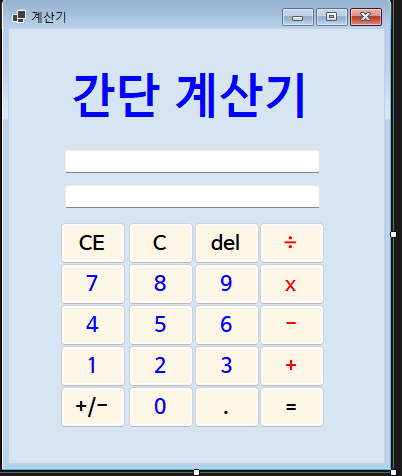

**- 과제(1) Num 버튼 클릭 시 입력창에 숫자 추가 기능 구현▼**
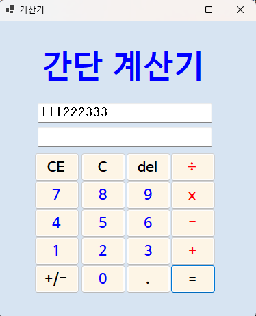

 **- 과제(1) 피연산자와 연산자(더하기) 입력창 결과창 연결▼**

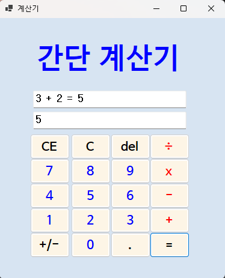

## **- 과제(1) 결과화면 ▼ -**

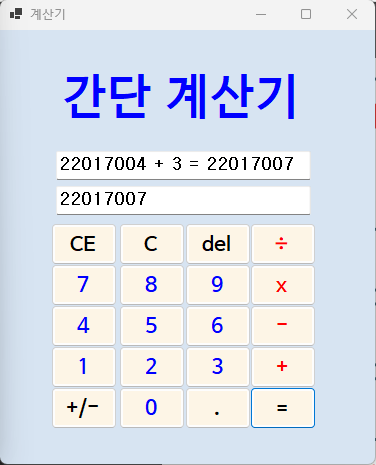

 # (과제2) - 나머지 연산자 구현 및 예외 처리 그리고 UI 개선

 ## -과제 내용-  

    사칙연산 완성 (빼기,곱하기,나누기)
    
    § 빼기, 곱하기, 나누기 구현하기
    
    1. 뺄셈(-), 곱셈(*), 나눗셈(/) 이벤트 핸들러 추가
    
    2. 이벤트 연결
    - 각 버튼 클릭 시 연산자만 변경하여 동일 로직 적용

    3. 예외 처리
    - 0으로 나누기 예외 처리
    - 잘못된 입력 예외 처리

    4. UI 개선
    - 버튼과 TextBox의 크기와 위치 조정
    - 폰트 스타일과 색상 변경하여 가독성 향상
    

  
  ## **- 과제(2) 결과화면-**
  **빼기▼**

 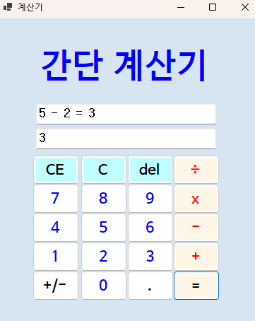

 **곱하기▼**

 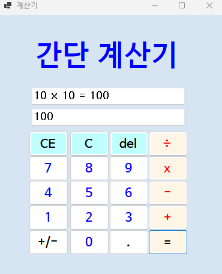
 
 **나누기▼**

 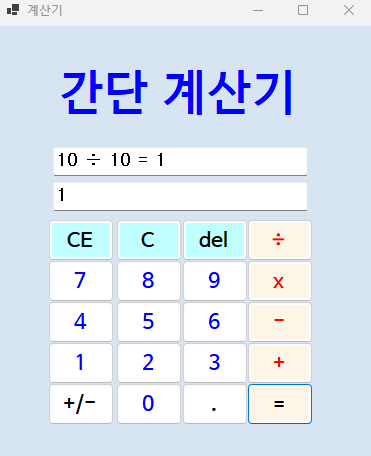

 # (과제3) - C, CE, Del 버튼 기능 추가 구현

 ## -과제 내용-  

    • 목표
    § 계산기에 있는 수정/삭제 기능 구현
     내용
    
    1. C 버튼 이벤트 추가 및 연결
    ▶ 현재의 모든 내용을 삭제하고 처음 (초기화된) 상태로 되돌아감
    
    2. CE 버튼 이벤트 추가 및 연결
    ▶ 마지막 입력한 피연산자(Operand) 값을 삭제함
    ▶ 100 입력 후에 Del 눌렀다면 100 값이 통째로 삭제됨
    
    3. Del 버튼 이벤트 추가 및 연결
    ▶ 마지막 입력된 글자 하나 (숫자 하나) 값을 삭제함
    ▶ 100 입력 후에 Del 눌렀다면 10 으로 변경됨
 
 ## **- 과제(3) 결과화면-**
 
 **C 버튼 누르기 전 화면▼**
 
 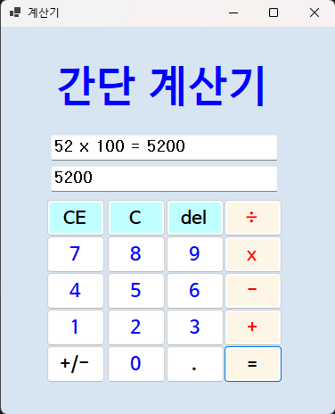

 **C 버튼 누른 후 화면▼**

 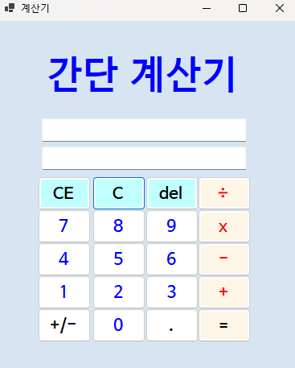

  **CE 버튼 누르기 전 화면▼**

 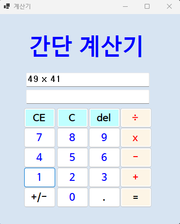

  **CE 버튼 누른 후 화면 (피연산자 통째로 사라짐)▼**
 
 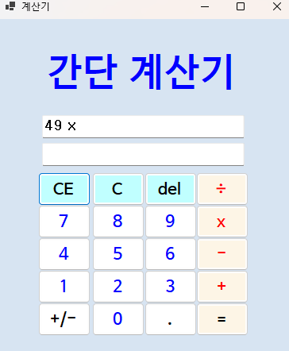

  **del 버튼 누르기 전 화면▼**
 
 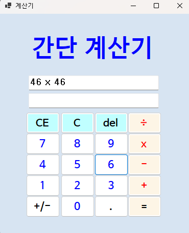
 
  **del 버튼 누른 후 화면(피연산자 하나씩만 삭제)▼**

 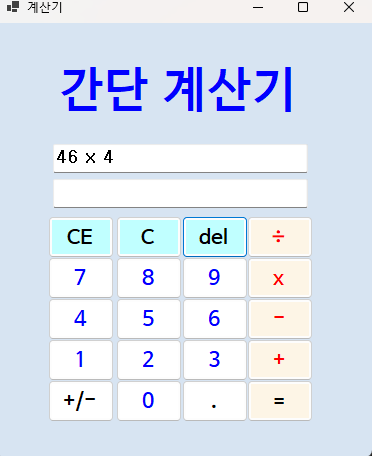

    
